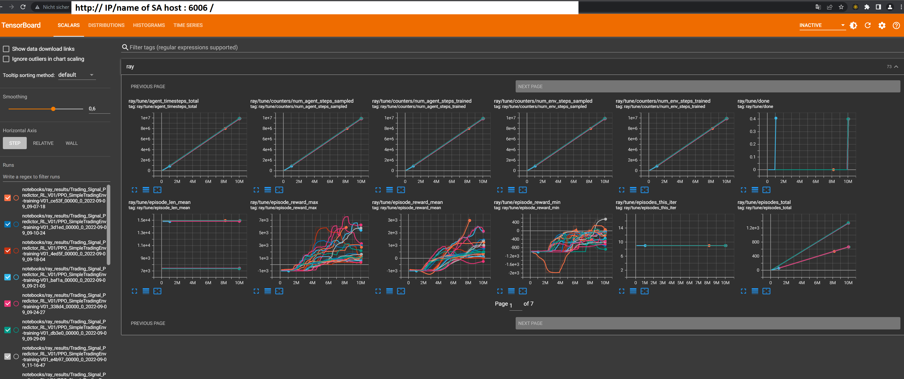
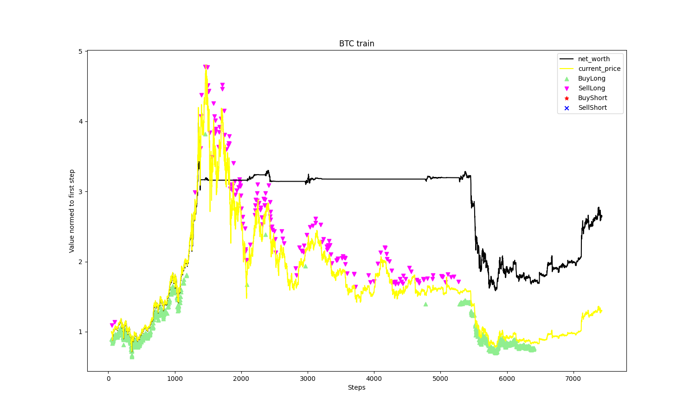
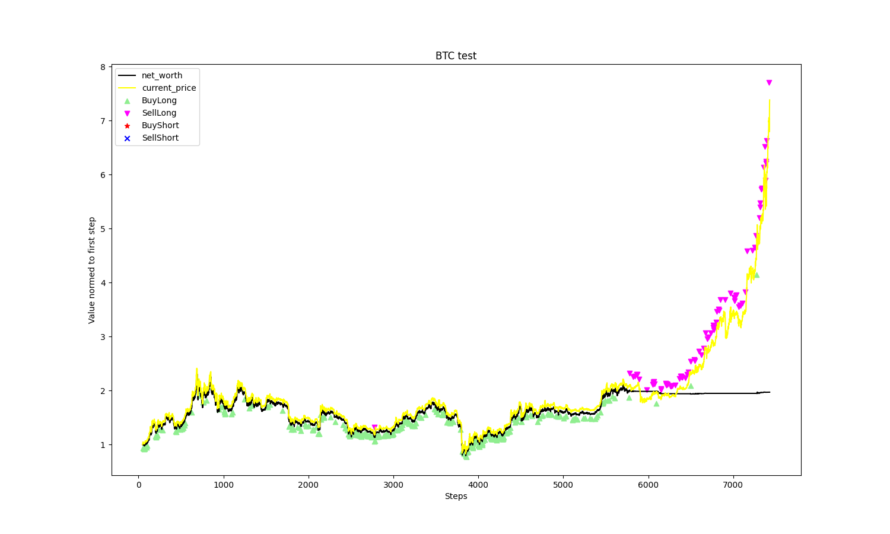
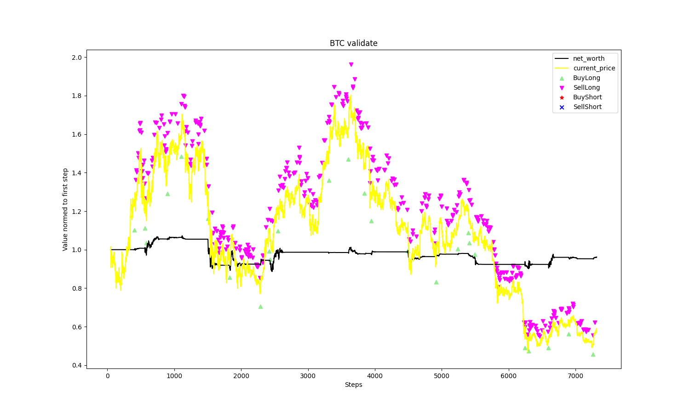

# Reinforcement Learning
## 💫 1. Introduction
[Reinforcement Learning](https://en.wikipedia.org/wiki/Reinforcement_learning) is a term used to describe a special machine learning process. The typical framing of a Reinforcement Learning (RL) scenario: An agent takes actions in an environment, which is interpreted into a reward and a representation of the state, which are fed back into the agent.


In our usage case, the environment is a stock trading one and the possible actions are buy, sell or hold. The reward will be our gain or loss. Based on this reward the agent will learn how to trade better. The process of learning is done with a so called [Proximal Policy Optimization (PPO)](https://en.wikipedia.org/wiki/Proximal_Policy_Optimization).

At the end the agent will provide us an action for the current candle. The possible actions at the moment are:
* 0 -> buy long market
* 1 -> sell long market
* 2 -> buy long limit
* 3 -> sell long limit
* 4 -> buy short market
* 5 -> sell short market
* 6 -> buy short limit
* 7 -> sell short limit
* 8 -> hold

For buy and sell signals an additionaly percentage is provided. This percentage indicates the share of the available cash/asset to use within the current action.
For limit orders an additionaly factor is provided. The limit is calculated as previous close price * limit_factor.

## 📒 2. Configuration
The basic config has to be done as pointed out in [Bitcoin Factory ReadMe](./README.md). Hereafter the differences for Reinforcement Learning are shown.
### 2.1 Testserver config
To run a Testserver for RL und need to change the configuration of the testserver node in SA. First you need to define the python script, which should be used for the docker sessions on the clients.
Second you need to define the range of parameters to be tested: For example the learning rate and so on.
```js
{
    ...
    "pythonScriptName": "Bitcoin_Factory_RL.py",
    ...
    "parametersRanges": {
        "LIST_OF_ASSETS": [
            [
                "BTC"
            ]
        ],
        "LIST_OF_TIMEFRAMES": [
            [
                "01-hs"
            ],
            [
                "02-hs"
            ]
        ],
        "NUMBER_OF_LAG_TIMESTEPS": [
            10
        ],
        "PERCENTAGE_OF_DATASET_FOR_TRAINING": [
            80
        ],
        "NUMBER_OF_EPOCHS": [
            750
        ],
        "NUMBER_OF_LSTM_NEURONS": [
            50
        ],
        "TIMESTEPS_TO_TRAIN": [
            1e7
        ],
        "OBSERVATION_WINDOW_SIZE": [
            24,
            48
        ],
        "INITIAL_QUOTE_ASSET": [
            1000
        ],
        "INITIAL_BASE_ASSET": [
            0
        ],
        "TRADING_FEE": [
            0.01
        ],
        "ENV_NAME": [
            "SimpleTrading"
        ],
        "ENV_VERSION": [
            1
        ],
        "REWARD_FUNCTION": [
            "unused"
        ],
        "EXPLORE_ON_EVAL": [
            "unused"
        ],
        "ALGORITHM": [
            "PPO"
        ],
        "ROLLOUT_FRAGMENT_LENGTH": [
            200
        ],
        "TRAIN_BATCH_SIZE": [
            2048
        ],
        "SGD_MINIBATCH_SIZE": [
            64
        ],
        "BATCH_MODE": [
            "complete_episodes"
        ],
        "FC_SIZE": [
            256
        ],
        "LEARNING_RATE": [
            0.00001
        ],
        "GAMMA": [
            0.95
        ]        
    }
}
```
### 2.2 Testclient config
No special config is needed. Look at [Bitcoin Factory Test Client ReadMe](./Test-Client/README.md)
But run **only one client per machine** (The python script takes care of parallel execution on its own).
#### 2.2.1 Tensorboard
During run the test-client stores results under Bitcoin-Factory/Test-Client/notebooks/ray_results/. You can easly monitor them with tensorboard. To get tensorboard working a slightly changed docker container is needed
* change CMD to
```
bash -c source /etc/bash.bashrc && tensorboard --logdir=/tf/ --host=0.0.0.0 &> log_tensorboard & jupyter notebook --notebook-dir=/tf --ip 0.0.0.0 --no-browser --allow-root
```
* expose port 6006


## 💡 3. Results
> __Note__
> The processing of one test case on the client takes roughly 6h-9h on a recent System.

The provided timeseries values are devided in 3 parts (Train, Test, Validate). The first one (train) is used to train the network. The second one (test) is used by the PPO-agent to evaluate the current network during the learning process. The third part is never seen by the agent, it is used to validate if the trained network is able to trade profitable on unseen data.

At the end the python script produces 3 charts to visualize the results. The follwing 3 examples are preliminary - made by a network which isn't well trained. 




Furthermore, some statistical evaluations are carried out using [quantstats](https://github.com/ranaroussi/quantstats) and summarised in each case in an HTML file.

## 🤝 4. Support

Contributions, issues, and feature requests are welcome!

Give a ⭐️ if you like this project or even better become a part of the Superalgos community!